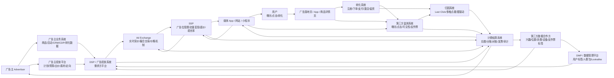
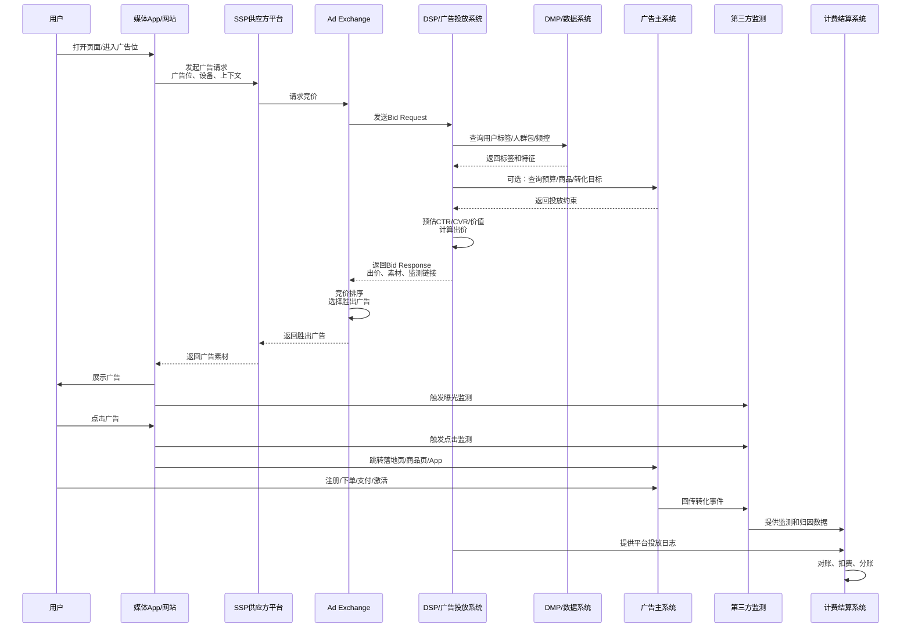

## 回答路线

下面从三个层次说明广告系统：

1. **各类系统分别做什么**
2. **它们之间如何协作**
3. **用一张全链路图展示广告从投放、竞价、曝光、点击、转化到结算的完整过程**

---

# 一、广告系统的整体定位

广告系统的核心目标是：

> 在合适的时间、合适的媒体、合适的人群面前，展示合适的广告，并对广告效果进行度量、优化和结算。

和推荐系统相比，广告系统除了要解决“内容/商品/广告是否匹配用户兴趣”的问题，还要额外处理：

- **预算控制**
- **出价竞价**
- **广告主投放诉求**
- **媒体流量变现**
- **第三方监测**
- **归因分析**
- **计费结算**
- **数据合规**
- **多方系统对接**
- **商业合同与审计**

因此广告系统的工程复杂度通常明显高于普通推荐系统。

---

# 二、主要广告系统及作用

## 1. 广告主系统

广告主系统是广告需求方的业务系统，通常由品牌方、电商商家、游戏公司、金融公司、应用开发商等拥有。

### 主要作用

| 模块 | 作用 |
|---|---|
| **商品/服务系统** | 提供待推广的商品、服务、App、活动页等信息 |
| **用户数据系统** | 提供广告主自有用户数据，例如会员、购买人群、潜客、流失用户 |
| **转化数据系统** | 回传下单、支付、注册、激活、留资等转化事件 |
| **CRM/CDP 系统** | 管理用户生命周期、标签、分层、营销策略 |
| **投放管理系统** | 管理广告计划、预算、出价、素材、定向、人群包 |
| **财务系统** | 负责充值、消耗、对账、发票、结算 |

### 举例

广告主希望投放一批广告：

- 推广一个新手机
- 目标人群是“最近浏览过手机但未购买的用户”
- 每日预算 50 万
- 按点击 CPC 或转化 CPA 优化
- 需要回传购买数据，用于优化模型

这时广告主系统需要向广告平台提供：

- 商品信息
- 落地页
- 素材
- 预算
- 定向条件
- 转化回传接口
- 人群数据或标签

---

## 2. 广告平台 / 广告投放系统

广告平台是连接广告主和媒体流量的核心系统。它可以是京东、腾讯、阿里、字节、百度等平台内部广告系统，也可以是独立 DSP。

### 主要作用

| 模块 | 作用 |
|---|---|
| **广告主平台** | 供广告主创建计划、单元、创意、预算、定向 |
| **广告检索系统** | 从海量广告中召回候选广告 |
| **广告排序系统** | 根据预估点击率、转化率、出价、质量分进行排序 |
| **竞价系统** | 决定广告是否参与竞价、出价多少、排名如何 |
| **预算系统** | 控制日预算、总预算、匀速投放、超投风险 |
| **频控系统** | 控制同一用户看到同一广告的次数 |
| **定向系统** | 根据地域、性别、兴趣、购买意向、人群包等筛选广告 |
| **素材审核系统** | 审核广告素材是否合法合规 |
| **计费系统** | 根据曝光、点击、转化等事件进行扣费 |
| **报表系统** | 向广告主展示曝光、点击、消耗、ROI 等数据 |
| **模型系统** | 预估 CTR、CVR、GMV、LTV、留存等指标 |

### 核心公式示例

广告排序常见会综合考虑：

```text
广告排序分 = 出价 × 预估点击率 × 预估转化率 × 质量因子
```

不同计费模式下，排序公式会有所不同：

| 计费模式 | 含义 | 常见优化目标 |
|---|---|---|
| **CPM** | 按千次曝光计费 | 品牌曝光 |
| **CPC** | 按点击计费 | 引流 |
| **CPA** | 按行为计费 | 注册、下单、激活 |
| **CPS** | 按销售分成计费 | 电商成交 |
| **oCPM** | 按曝光计费，按转化优化 | 转化效果 |
| **oCPC** | 按点击计费，按转化优化 | 转化效果 |

---

## 3. Ad Exchange，广告交易平台

**Ad Exchange** 是广告流量的实时交易市场。

它连接媒体方和广告需求方，使广告展示机会可以通过实时竞价方式出售。

### 主要作用

| 作用 | 说明 |
|---|---|
| **流量聚合** | 汇聚多个媒体/App/网站的广告位流量 |
| **实时竞价 RTB** | 每次广告请求都可以触发一次竞价 |
| **撮合交易** | 在多个 DSP 或广告平台之间选择最高价值广告 |
| **价格机制** | 支持一价、二价、底价、保价、PMP 等交易方式 |
| **流量分发** | 将广告请求发送给多个买方系统 |
| **交易记录** | 记录请求、出价、胜出、曝光、结算信息 |

### 简单理解

Ad Exchange 类似一个广告流量交易市场：

- 媒体方提供广告位，例如 App 开屏、信息流、视频贴片
- 广告主或 DSP 出价购买这次展示机会
- Exchange 按规则选出胜出广告
- 媒体展示胜出的广告
- 后续产生曝光、点击、转化、计费

---

## 4. DSP，Demand-Side Platform，需求方平台

DSP 是广告主侧购买广告流量的平台。

广告主可以通过 DSP 在多个媒体、SSP、Ad Exchange 上统一购买流量。

### 主要作用

| 作用 | 说明 |
|---|---|
| **跨媒体采买** | 在多个媒体和交易平台购买广告流量 |
| **人群定向** | 根据用户标签、人群包、行为数据进行投放 |
| **实时出价** | 对每一次广告展示机会计算是否出价、出价多少 |
| **预算控制** | 控制广告主预算消耗 |
| **效果优化** | 根据点击、转化、ROI 调整出价和投放策略 |
| **反作弊过滤** | 过滤异常流量、无效点击、机器人流量 |

### DSP 典型决策

当 DSP 收到一次广告请求时，会判断：

1. 这个用户是不是目标人群？
2. 这个广告位质量如何？
3. 当前广告主还有没有预算？
4. 预估点击率和转化率是多少？
5. 应该出价多少？
6. 是否存在频控、合规、品牌安全风险？

---

## 5. SSP，Supply-Side Platform，供应方平台

SSP 是媒体侧的流量管理和变现平台。

媒体可以通过 SSP 把自己的广告位卖给多个广告主、DSP 或 Ad Exchange。

### 主要作用

| 作用 | 说明 |
|---|---|
| **广告位管理** | 管理媒体的开屏、信息流、Banner、视频等广告位 |
| **流量变现** | 帮助媒体获得更高广告收入 |
| **底价控制** | 设置不同广告位、不同人群、不同时间的最低价格 |
| **买方接入** | 对接多个 DSP、Ad Exchange、广告网络 |
| **收益优化** | 在不同买方之间选择收益最高的广告 |
| **填充率优化** | 保证广告位尽可能被填充 |

### SSP 关注的核心指标

| 指标 | 含义 |
|---|---|
| **填充率 Fill Rate** | 有广告返回的请求占比 |
| **eCPM** | 千次曝光收入 |
| **广告收入** | 媒体实际获得收入 |
| **延迟** | 广告请求返回时间 |
| **用户体验** | 广告是否过多、是否打扰用户 |

---

## 6. Ad Network，广告网络

Ad Network 是较早期、相对传统的广告流量聚合和转售平台。

它通常从多个媒体采购广告位，再打包卖给广告主。

### 和 Ad Exchange 的区别

| 对比项 | Ad Network | Ad Exchange |
|---|---|---|
| 交易方式 | 批量采买、打包售卖 | 实时竞价、实时撮合 |
| 透明度 | 相对较低 | 相对较高 |
| 技术要求 | 较低 | 较高 |
| 价格机制 | 固定价格、协议价较多 | RTB、竞价、PMP 较多 |
| 优化粒度 | 媒体包、频道、人群包 | 单次请求、单个用户、单次展示 |

---

## 7. 第三方计费度量系统

第三方计费度量系统用于对广告投放效果进行独立监测、验证和审计。

它不完全依赖广告平台自报数据，而是站在相对中立的位置提供监测结果。

### 主要类型

| 类型 | 作用 |
|---|---|
| **第三方曝光监测** | 统计广告是否真实曝光 |
| **第三方点击监测** | 统计广告点击次数 |
| **可见性监测** | 判断广告是否真正进入用户可视区域 |
| **反作弊监测** | 识别机器人、刷量、异常点击 |
| **品牌安全监测** | 判断广告是否出现在不适合的内容旁边 |
| **归因系统** | 判断转化应归属于哪个广告触点 |
| **计费审计系统** | 用于广告主、媒体、平台之间对账 |
| **MMP 移动监测伙伴** | 监测 App 激活、注册、付费等转化事件 |

### 为什么需要第三方监测？

因为广告交易中有多方利益：

- 广告平台希望证明投放有效
- 广告主希望确认钱花得真实有效
- 媒体希望确认自己应得收入
- 代理商希望有可审计的数据依据

第三方度量系统可以降低争议，提高交易信任。

### 常见监测事件

| 事件 | 说明 |
|---|---|
| **曝光 Impression** | 广告被展示 |
| **可见曝光 Viewable Impression** | 广告满足可视条件 |
| **点击 Click** | 用户点击广告 |
| **到达 Landing** | 用户到达落地页 |
| **注册 Register** | 用户完成注册 |
| **加购 Add to Cart** | 用户加入购物车 |
| **下单 Order** | 用户提交订单 |
| **支付 Pay** | 用户完成付款 |
| **激活 Activation** | App 被安装并首次打开 |
| **留存 Retention** | 用户次日或多日后继续使用 |

---

## 8. 数据采买和合作公司系统

数据采买和合作公司系统通常用于补充广告平台自身数据，提高定向和优化能力。

这些公司可能包括：

- 第三方 DMP
- 数据供应商
- 运营商数据合作方
- 金融数据合作方
- 位置数据供应商
- 内容标签供应商
- 行业数据合作方
- 品牌安全服务商
- 反作弊服务商

### 主要作用

| 作用 | 说明 |
|---|---|
| **补充用户画像** | 提供兴趣、消费能力、行业偏好等标签 |
| **扩展人群包** | 基于种子用户寻找相似人群 |
| **增强定向能力** | 支持更精细的人群、地域、场景投放 |
| **数据建模** | 为 CTR、CVR、LTV 模型提供外部特征 |
| **归因辅助** | 提供跨平台触点或转化数据 |
| **反作弊识别** | 提供异常设备、黑产流量识别能力 |
| **行业洞察** | 提供竞品、市场、人群趋势分析 |

### 典型合作数据

| 数据类型 | 示例 |
|---|---|
| **人口属性** | 年龄段、性别、城市等级 |
| **兴趣偏好** | 汽车、母婴、数码、运动 |
| **消费能力** | 高消费、中消费、价格敏感 |
| **地理位置** | 商圈、门店附近、通勤区域 |
| **设备信息** | 设备型号、系统版本、联网环境 |
| **内容上下文** | 页面主题、视频内容标签、文章分类 |
| **风险标签** | 疑似作弊设备、异常点击设备 |

### 关键注意事项

数据合作必须重点关注：

- **用户授权**
- **隐私合规**
- **数据最小化**
- **脱敏与加密**
- **数据使用边界**
- **可审计性**
- **合同约束**
- **数据安全**

---

## 9. DMP / CDP，人群与数据管理平台

DMP 和 CDP 都与用户数据管理有关，但定位不同。

| 系统 | 全称 | 核心作用 |
|---|---|---|
| **DMP** | Data Management Platform | 广告投放人群管理，偏营销和匿名标识 |
| **CDP** | Customer Data Platform | 企业客户数据管理，偏一方客户资产和全生命周期运营 |

### DMP 作用

- 汇聚多方用户行为数据
- 打标签
- 建人群包
-做人群扩展 Lookalike
- 支持广告定向
- 支持频控和归因

### CDP 作用

- 管理企业一方客户数据
- 统一会员 ID
- 分层运营
- 生命周期管理
- 营销自动化
- 与 CRM、广告平台打通

---

## 10. 归因系统

归因系统用于判断一次转化应该算给哪个广告触点。

### 常见归因模型

| 归因模型 | 说明 |
|---|---|
| **Last Click** | 最后一次点击归因 |
| **First Click** | 第一次点击归因 |
| **Last Touch** | 最后一次触达归因 |
| **线性归因** | 多个触点平均分配贡献 |
| **时间衰减** | 越靠近转化的触点权重越高 |
| **数据驱动归因** | 用模型估计不同触点贡献 |

### 为什么复杂？

一个用户在购买前可能经历：

1. 看过品牌广告
2. 搜索过商品
3. 点击过信息流广告
4. 进入电商平台比价
5. 收到短信或 Push
6. 最后通过搜索广告下单

此时“转化应该算给谁”就非常复杂，涉及预算分配和商业利益。

---

## 11. 计费结算系统

计费结算系统负责把广告事件转化为真实财务数据。

### 主要作用

| 模块 | 作用 |
|---|---|
| **计费事件采集** | 收集曝光、点击、转化等计费事件 |
| **计费规则执行** | 按 CPM、CPC、CPA、CPS 等规则计费 |
| **扣费系统** | 从广告主账户扣除费用 |
| **媒体分成系统** | 给媒体或合作方结算收益 |
| **对账系统** | 对比广告平台、第三方、媒体、广告主数据 |
| **发票系统** | 支持开票和财务流程 |
| **风控系统** | 识别异常消耗、作弊流量、恶意点击 |
| **审计系统** | 留存可追溯日志，支持争议处理 |

---

# 三、这些系统之间的关系

可以从 **需求方、交易层、供给方、数据层、度量层、结算层** 六个角度理解。

---

## 1. 需求方：广告主想买流量

广告主的诉求是：

- 提升品牌曝光
- 获取用户点击
- 获得注册、下单、购买、留资等转化
- 控制成本
- 提升 ROI

广告主通过以下系统参与广告投放：

```text
广告主系统 → 广告平台 / DSP → Ad Exchange / SSP → 媒体广告位
```

---

## 2. 供给方：媒体想卖流量

媒体的诉求是：

- 把广告位卖出去
- 提高广告收入
- 保证用户体验
- 控制广告质量

媒体通过以下系统变现：

```text
媒体 App / 网站 → SSP → Ad Exchange → DSP / 广告平台 → 广告主
```

---

## 3. 交易层：Ad Exchange 负责撮合

Ad Exchange 是中间交易市场：

```text
多个 DSP 出价 → Ad Exchange 竞价 → 最高价值广告胜出 → 返回给媒体展示
```

它不一定直接代表广告主，也不一定直接拥有媒体，而是负责交易规则、竞价撮合和记录。

---

## 4. 数据层：DMP、CDP、第三方数据增强决策

广告系统需要数据来判断：

- 用户是谁
- 用户可能喜欢什么
- 用户是否可能点击
- 用户是否可能购买
- 这个流量是否有价值
- 这个设备是否存在作弊风险

数据来源包括：

```text
广告主一方数据
媒体行为数据
平台历史投放数据
第三方数据供应商
DMP / CDP 人群标签
反作弊和品牌安全数据
```

---

## 5. 度量层：第三方监测负责验证

广告投放后，需要回答：

- 广告是否真的曝光？
- 用户是否真的点击？
- 曝光是否可见？
- 点击是否作弊？
- 转化是否发生？
- 转化应该归因给哪个广告？
- 平台报表和第三方报表差异多少？

因此第三方监测会接入：

```text
广告曝光监测
点击监测
落地页监测
App 激活监测
转化回传
反作弊校验
可见性检测
```

---

## 6. 结算层：计费系统负责钱的流转

最终会形成资金流：

```text
广告主付款 → 广告平台扣费 → 媒体/SSP/Exchange/数据方/监测方分账
```

结算系统需要处理：

- 广告主消耗
- 平台收入
- 媒体分成
- 数据服务费
- 监测服务费
- 代理商返点
- 税务发票
- 对账争议

---

# 四、广告系统全链路图示

## 1. 全局架构图



---

## 2. 实时竞价 RTB 流程图



---

## 3. 数据流、请求流、资金流关系图

```text
                           ┌──────────────────────────┐
                           │        广告主系统          │
                           │ 商品/预算/素材/CRM/转化数据 │
                           └────────────┬─────────────┘
                                        │
                                        │ 投放配置 / 转化回传
                                        ▼
┌────────────────────┐       ┌──────────────────────────┐
│ 第三方数据合作方     │──────▶│ DSP / 广告投放系统         │
│ 标签/位置/兴趣/风控   │ 数据  │ 定向/出价/预算/模型/频控    │
└────────────────────┘       └────────────┬─────────────┘
                                           │ Bid Response
                                           ▼
                               ┌──────────────────────┐
                               │     Ad Exchange       │
                               │  RTB竞价/撮合/交易记录 │
                               └──────────┬───────────┘
                                          ▲
                                          │ Bid Request
┌────────────────────┐       ┌──────────┴───────────┐
│ 媒体 App / 网站      │──────▶│        SSP            │
│ 用户流量/广告位       │ 请求  │ 广告位管理/底价/变现    │
└─────────┬──────────┘       └──────────────────────┘
          │
          │ 曝光/点击
          ▼
┌────────────────────┐
│        用户          │
└─────────┬──────────┘
          │ 转化
          ▼
┌────────────────────┐
│ 落地页/商城/App/活动页 │
└─────────┬──────────┘
          │
          │ 曝光、点击、转化日志
          ▼
┌────────────────────┐
│ 第三方监测/归因系统   │
│ 可见性/反作弊/归因     │
└─────────┬──────────┘
          │
          │ 监测数据 / 归因结果
          ▼
┌────────────────────┐
│ 计费结算/对账系统     │
│ 扣费/分账/发票/审计    │
└────────────────────┘
```

---

# 五、广告一次展示的完整生命周期

下面以“用户打开 App 信息流，系统展示一条广告”为例。

## 阶段 1：广告主准备投放

广告主在投放平台配置：

- 广告计划
- 广告预算
- 出价方式
- 推广商品
- 广告素材
- 定向人群
- 落地页
- 转化目标
- 监测链接

广告主系统可能同步：

- 商品库
- 库存
- 价格
- 优惠信息
- CRM 人群包
- 转化回传接口

---

## 阶段 2：媒体产生广告请求

用户打开 App 或网页。

媒体系统会产生广告请求，请求中通常包含：

| 信息 | 示例 |
|---|---|
| 广告位 | 首页信息流第 3 位 |
| 设备信息 | 设备型号、系统、网络 |
| 用户标识 | Cookie、IDFA、OAID、内部用户 ID |
| 地理位置 | 城市、商圈 |
| 内容上下文 | 当前频道、文章分类、视频标签 |
| 广告尺寸 | 640x320 |
| 支持素材类型 | 图片、视频、原生广告 |
| 底价 | 最低 eCPM |
| 隐私授权状态 | 是否允许个性化广告 |

---

## 阶段 3：SSP 或 Ad Exchange 发起竞价

SSP/Exchange 将广告请求包装成 Bid Request，发送给多个 DSP。

Bid Request 主要包括：

- 广告位信息
- 用户标识
- 设备信息
- 上下文信息
- 底价
- 媒体信息
- 请求超时时间
- 隐私合规字段

---

## 阶段 4：DSP 决策是否出价

DSP 收到请求后，会进行多步判断：

1. **合法性校验**
   - 请求是否有效
   - 用户是否授权
   - 流量是否可投

2. **人群匹配**
   - 是否命中广告主目标人群
   - 是否命中排除人群
   - 是否达到频控上限

3. **预算判断**
   - 广告主余额是否充足
   - 日预算是否接近消耗完
   - 是否需要匀速投放

4. **模型预估**
   - 预估点击率 CTR
   - 预估转化率 CVR
   - 预估订单金额 GMV
   - 预估长期价值 LTV

5. **出价计算**
   - 根据目标成本、转化概率、竞争强度计算 bid price

6. **素材选择**
   - 选择最适合当前用户和场景的创意

7. **返回出价**
   - 返回价格、素材、落地页、监测链接

---

## 阶段 5：Ad Exchange 竞价并选出胜者

Ad Exchange 收到多个 DSP 的出价后，进行：

- 价格比较
- 底价校验
- 广告质量校验
- 行业冲突限制
- 素材格式校验
- 黑白名单过滤
- 竞价机制计算

最后选出胜出广告。

---

## 阶段 6：广告曝光与监测

媒体展示广告后：

- 平台记录曝光日志
- 第三方监测记录曝光
- 可见性系统判断是否可见
- 反作弊系统判断是否异常流量

如果用户点击广告：

- 平台记录点击日志
- 第三方监测记录点击
- 用户跳转到落地页

---

## 阶段 7：用户转化与归因

用户在落地页或 App 内完成：

- 浏览
- 注册
- 加购
- 下单
- 支付
- 激活
- 留资

转化数据会回传给：

- 广告主系统
- 广告平台
- DSP
- 第三方监测系统
- 归因系统

归因系统根据规则判断这次转化属于哪个广告触点。

---

## 阶段 8：计费、对账与结算

计费系统根据广告合同和计费模式进行扣费。

例如：

| 计费模式 | 扣费事件 |
|---|---|
| CPM | 有效曝光 |
| CPC | 有效点击 |
| CPA | 有效转化 |
| CPS | 实际成交金额分成 |
| oCPM | 按曝光扣费，但按转化目标优化 |
| CPT | 按时间段包量计费 |

之后进入：

- 广告主扣费
- 媒体分成
- Exchange 服务费
- DSP 服务费
- 数据服务费
- 第三方监测服务费
- 代理商返点
- 财务对账
- 开票结算

---

# 六、各系统之间的核心关系总结

## 1. 业务关系

| 角色 | 核心诉求 | 依赖系统 |
|---|---|---|
| **广告主** | 买到有效用户和转化 | DSP、广告平台、DMP、监测系统 |
| **媒体** | 卖出广告位并提升收入 | SSP、Ad Exchange、广告平台 |
| **广告平台/DSP** | 帮广告主高效买流量 | 数据系统、模型系统、Exchange |
| **SSP** | 帮媒体高效卖流量 | Exchange、DSP、广告网络 |
| **Ad Exchange** | 撮合买卖双方 | DSP、SSP、交易规则 |
| **第三方监测** | 独立验证投放效果 | 媒体、广告平台、广告主 |
| **数据合作方** | 提供数据能力 | DMP、DSP、广告主 |
| **计费系统** | 完成资金结算 | 所有交易与监测日志 |

---

## 2. 技术关系

| 层级 | 代表系统 | 技术重点 |
|---|---|---|
| **请求层** | 媒体 SDK、广告网关、SSP | 高并发、低延迟 |
| **交易层** | Ad Exchange、RTB | 毫秒级竞价、撮合、价格机制 |
| **决策层** | DSP、广告排序系统 | CTR/CVR 预估、出价、预算控制 |
| **数据层** | DMP、CDP、数据合作方 | 标签、人群包、隐私合规 |
| **监测层** | 第三方监测、反作弊 | 曝光、点击、可见性、作弊识别 |
| **结算层** | 计费、对账、分账 | 准确性、一致性、审计 |
| **分析层** | 报表、归因、BI | 效果分析、ROI 优化 |

---

## 3. 数据关系

广告系统中有几类关键数据流：

| 数据流 | 来源 | 去向 | 用途 |
|---|---|---|---|
| **广告配置数据** | 广告主 | DSP/广告平台 | 投放决策 |
| **用户行为数据** | 媒体/平台 | DMP/模型系统 | 定向和预估 |
| **竞价请求数据** | SSP/Exchange | DSP | 实时出价 |
| **出价响应数据** | DSP | Exchange/SSP | 参与竞价 |
| **曝光点击数据** | 媒体/监测 | 广告平台/计费 | 效果统计和扣费 |
| **转化数据** | 广告主/落地页/App | DSP/归因/计费 | 优化和归因 |
| **第三方监测数据** | 监测机构 | 广告主/平台 | 验证和对账 |
| **结算数据** | 计费系统 | 广告主/媒体/合作方 | 扣费与分账 |

---

# 七、广告系统相比推荐系统复杂在哪里

## 1. 目标不同

| 对比项 | 推荐系统 | 广告系统 |
|---|---|---|
| 核心目标 | 提升用户体验和内容消费 | 同时满足广告主 ROI、媒体收入、用户体验 |
| 排序依据 | 用户兴趣、内容质量 | 出价、预算、CTR、CVR、商业价值、合规 |
| 是否涉及资金 | 通常不直接涉及 | 强涉及扣费、结算、对账 |
| 是否涉及多方交易 | 较少 | 广告主、媒体、DSP、SSP、Exchange、第三方监测 |
| 是否需要第三方审计 | 较少 | 常见 |
| 是否需要实时竞价 | 通常不需要 | 高频存在 |
| 是否需要预算控制 | 较少 | 核心能力 |
| 是否需要反作弊 | 有，但商业影响相对弱 | 极其重要 |

---

## 2. 工程复杂度更高的原因

广告系统需要同时保证：

1. **低延迟**
   - RTB 请求通常要求几十到一两百毫秒内完成。

2. **高并发**
   - 每次页面访问、App 刷新、视频播放都可能产生广告请求。

3. **强一致计费**
   - 曝光、点击、转化、扣费、结算需要可追溯。

4. **预算准确控制**
   - 不能严重超投，也不能花不出去。

5. **多方日志对账**
   - 平台、媒体、第三方、广告主数据经常存在差异。

6. **复杂交易规则**
   - RTB、PMP、PD、保量、竞价、底价、优先级。

7. **合规和隐私**
   - 用户授权、数据脱敏、跨方数据使用边界都必须严格控制。

8. **反作弊要求高**
   - 作弊流量会直接造成广告主资金损失。

9. **商业规则复杂**
   - 返点、代理商、行业限制、品牌安全、合同承诺都会进入系统逻辑。

---

# 八、一个简化但完整的广告投放闭环

可以把广告系统理解为下面这个闭环：

```text
广告主设定目标
      ↓
广告平台创建计划、预算、定向、素材
      ↓
媒体产生广告请求
      ↓
SSP / Ad Exchange 发起交易
      ↓
DSP 基于用户、广告位、预算、模型实时出价
      ↓
Exchange 选择胜出广告
      ↓
媒体展示广告
      ↓
第三方监测曝光、点击、可见性
      ↓
用户产生转化
      ↓
转化回传和归因
      ↓
计费、对账、分账
      ↓
数据反哺模型和投放优化
      ↓
继续优化预算、出价、人群、素材
```

这个闭环的关键是：

> **投放决策依赖数据，数据来自投放结果，结果又影响下一轮投放决策。**

---

# 九、核心结论

1. **广告主系统**负责提供商品、预算、素材、人群和转化数据。
2. **DSP/广告投放系统**负责代表广告主买流量，核心能力是定向、出价、预算控制和效果优化。
3. **SSP**代表媒体卖流量，核心目标是提升填充率和广告收入。
4. **Ad Exchange**是广告交易市场，负责实时竞价和撮合。
5. **第三方计费度量系统**负责独立验证曝光、点击、转化、可见性、反作弊和归因结果。
6. **数据采买和合作公司系统**负责补充人群、标签、风控、场景和行业数据。
7. **DMP/CDP**负责管理用户数据、人群包和标签体系。
8. **归因系统**负责判断转化贡献归属。
9. **计费结算系统**负责扣费、对账、分账、发票和审计。
10. 广告系统的本质是一个同时连接 **人、货、场、预算、竞价、数据、计费、合规** 的复杂商业技术系统。

---

## 下一步建议

如果你要进一步深入广告系统设计，建议按以下顺序拆解：

1. **先理解广告投放链路**：广告主 → DSP → Exchange → SSP → 媒体 → 用户。
2. **再理解实时竞价 RTB**：请求、召回、预估、出价、竞价、返回。
3. **再理解计费与归因**：曝光、点击、转化、归因、扣费、对账。
4. **最后理解数据与模型**：DMP、用户画像、CTR/CVR、预算 pacing、反作弊。
